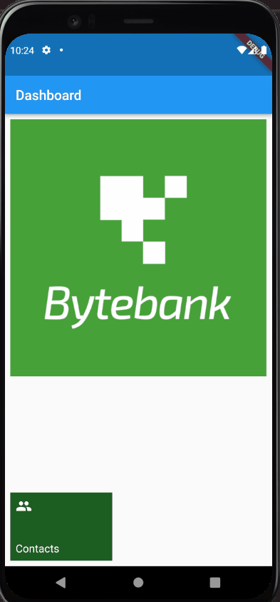

# Bytebank

O Bytebank App é a simulação do aplicativo de um banco. Com ele, você poderá fazer transações bancárias, informando o número da conta e o valor monetário da transação!

Esse repositório é uma continuação das funcionalidades criadas no projeto [Bytebank Fundamentos Flutter](https://github.com/alura-cursos/flutter-fundamentos).

## 🔨 Características do projeto

Neste projeto, você será capaz de criar e salvar novos contatos no Bytebank. Além disso aprenderá novos widgets para deixar a interface gráfica ainda mais funcional!

## ✔️ Técnicas e tecnologias

**Para desenvolver o projeto, utilizamos as seguintes técnicas e tecnologias:**

- `Material Design`: Refinamento da interface e novos componentes.
- `sqflite`: Instalar e configurar essa dependência para manipular um banco de dados SQLite.
- `async/await`: Ferramenta do Dart para manipulação de processos assíncronos que dispensa o uso do then.
- `FutureBuilder`: Componente para carregar dados de maneira assíncrona.

## 📁 Acesso ao projeto

Cada branch separa uma etapa do desenvolvimento do projeto, estando divididas da seguinte forma:

- [**aula-1**](https://github.com/alura-cursos/flutter-persistencia-interna/tree/aula-1) - Implementação do Dashboard
- [**aula-2**](https://github.com/alura-cursos/flutter-persistencia-interna/tree/aula-2) - Implementação do Fluxo de Telas
- [**aula-3**](https://github.com/alura-cursos/flutter-persistencia-interna/tree/aula-3) - Configuração do Banco de Dados
- [**aula-4**](https://github.com/alura-cursos/flutter-persistencia-interna/tree/aula-4) - Integração do Banco de Dados com as Telas
- [**aula-5**](https://github.com/alura-cursos/flutter-persistencia-interna/tree/aula-5) - Finalização do Fluxo com o Banco de dados

Você pode [baixar o zip](https://github.com/alura-cursos/flutter-persistencia-interna/archive/aula-5.zip) com o código final do projeto ou [acessar o código fonte](https://github.com/alura-cursos/flutter-persistencia-interna/tree/aula-5).

## 🛠️ Abrir e rodar o projeto

**Para executar este projeto, você precisa de:**

- Ter o [Flutter](https://flutter.dev/docs/get-started/install) instalado na sua máquina
- Ter algum editor de códigos ou IDE como o [Android Studio](https://developer.android.com/studio) ou [Intellij Idea](https://www.jetbrains.com/pt-br/idea/download/).

Caso opte por IDEs como as duas sugeridas acima, o processo de execução do aplicativo funcionará através de um botão de play na parte superior que ambas dispõem. Caso escolha rodar o projeto via linha de comandos, utilize o comando `flutter run`. Lembre-se de antes de executar o comando de navegar até a pasta do projeto antes.

Para mais instruções sobre a configuração do ambiente, recomendamos a leitura do artigo [Flutter - Como configurar o ambiente de desenvolvimento](https://www.alura.com.br/artigos/flutter-como-configurar-o-ambiente-de-desenvolvimento). Caso tenha desejo de obter conhecimento além dos cursos da [Formação Flutter](https://www.alura.com.br/formacao-flutter), recomendamos os livros [Iniciando com Flutter Framework](https://www.casadocodigo.com.br/products/livro-flutter) e [Aprofundando em Flutter](https://www.casadocodigo.com.br/products/livro-aprofundando-flutter) da editora [Casa do código](https://www.casadocodigo.com.br/).

## 📚 Mais informações do curso

Gostou do projeto e quer conhecer mais? Você pode acessar o curso [Persistência com Flutter: Crie um app com armazenamento interno](https://cursos.alura.com.br/course/flutter-persistencia-interna) que desenvolve o projeto desde o começo!

Esse curso faz parte da [formação de Flutter da Alura](https://cursos.alura.com.br/formacao-flutter)
